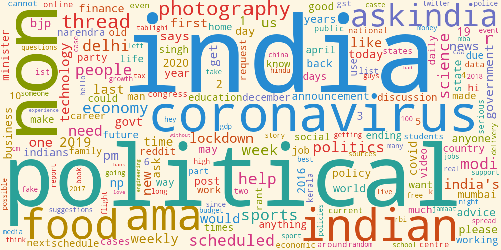
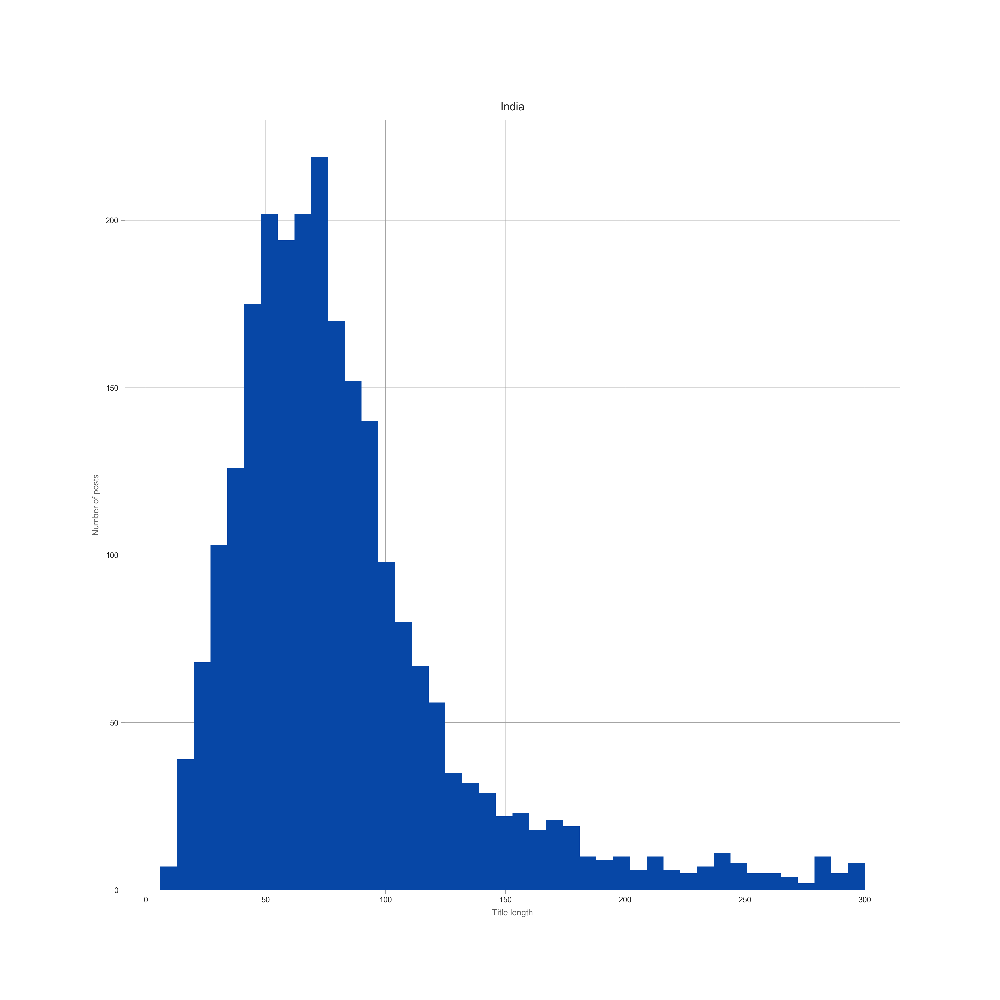
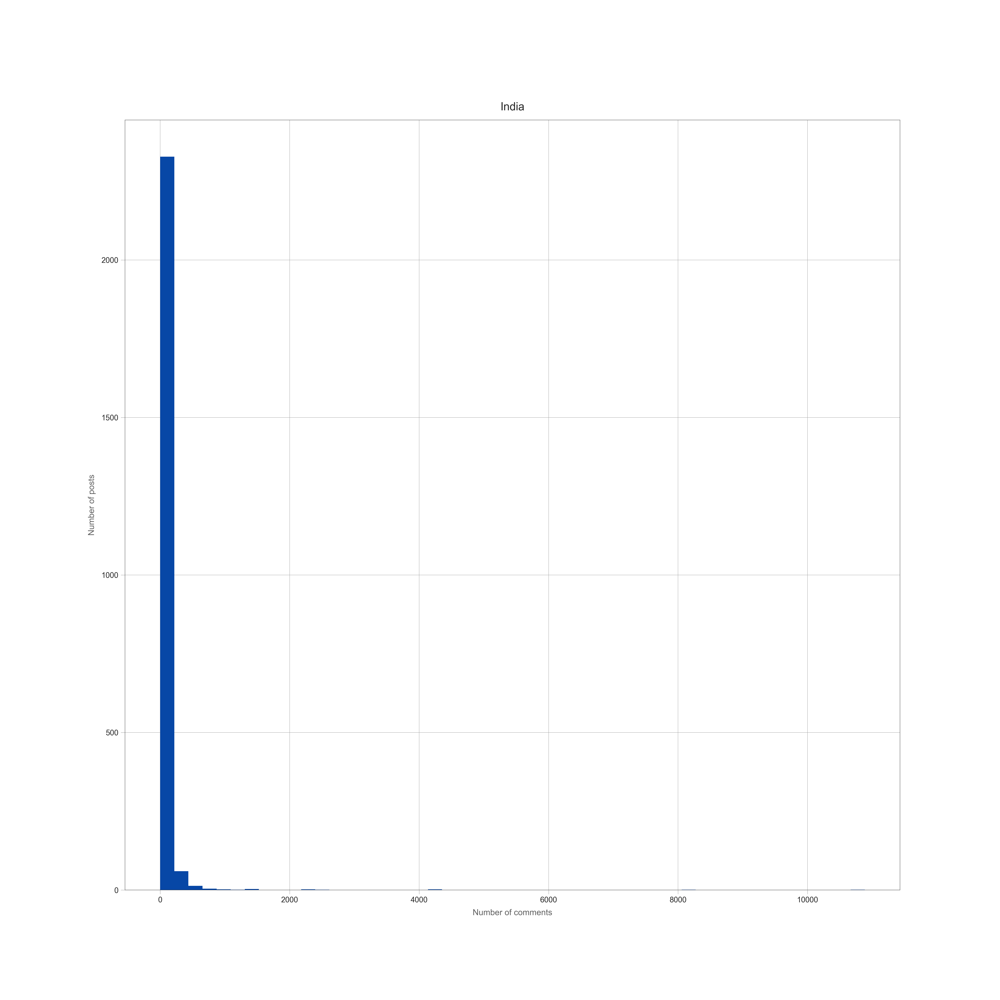
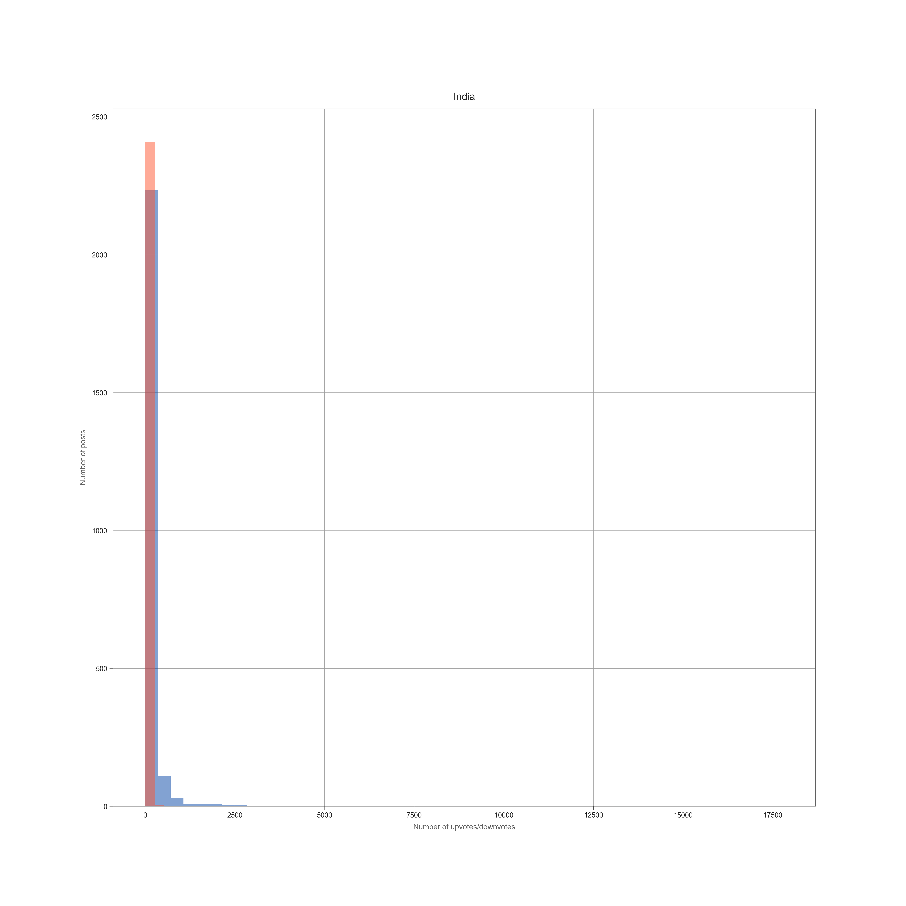
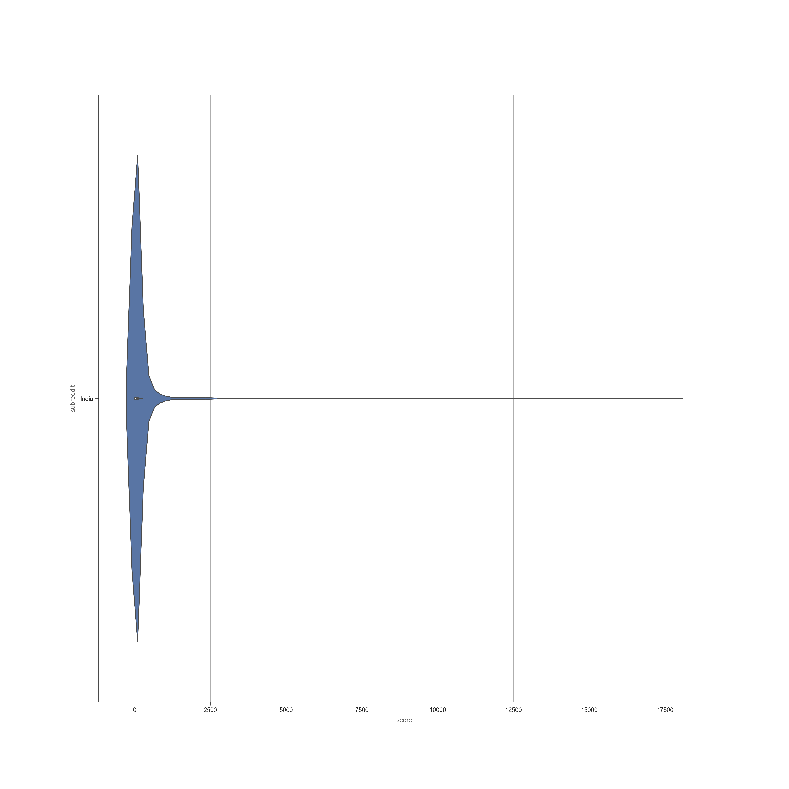
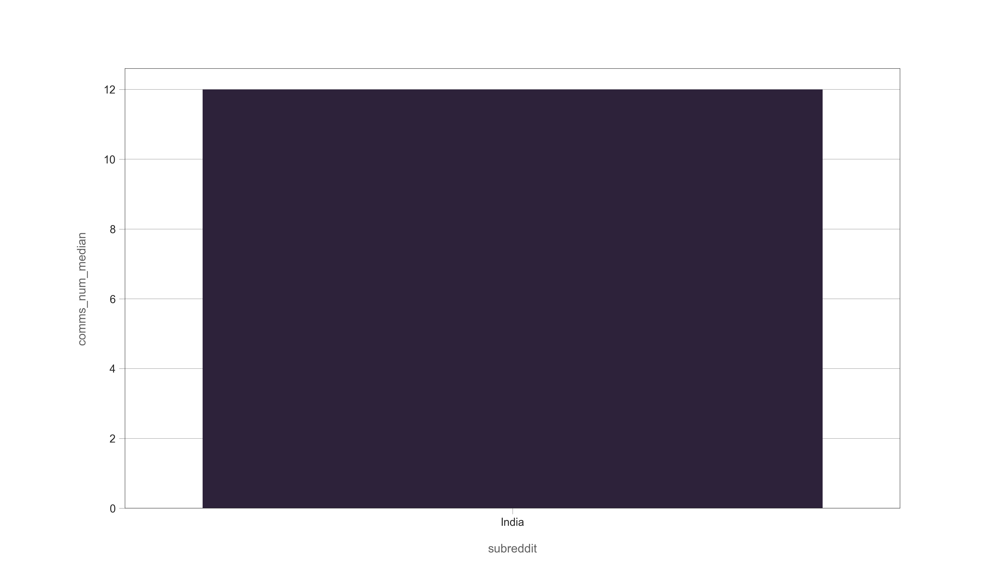

## Tree Structure
```
.
├── Procfile
├── README.md
├── Terminal\ Saved\ Output
├── Terminal\ Saved\ Output\ 2
├── __pycache__
│   └── app.cpython-37.pyc
├── app.py
├── model.pkl
├── model.py
├── nltk.txt
├── requirements.txt
├── scraping\ and\ visualization\ data
│   ├── mid_scr.py
│   ├── reddit_10Apr.csv
│   └── visual.py
├── static
│   ├── css
│   │   └── style.css
│   └── images
│       ├── india.png
│       ├── india2.png
│       ├── india3.png
│       ├── india4.png
│       ├── india5.png
│       ├── india6.png
│       └── india7.png
├── templates
│   ├── about.html
│   └── index.html
├── test.txt
├── test2.txt
└── uploads
    └── test.txt

7 directories, 26 files

```
# Reddit Flair Predictor

[Project Hosted on : Heroku (CSS not enabled due to memory issue )](https://damp-tundra-68404.herokuapp.com)

[Machine Learning Model: Google Drive link can be downloaded and used ](https://drive.google.com/open?id=16vAF5CTac_WusgsFWKQHybOIgawz6tP_)

### Python Files 

Part I - Reddit Data Collection - https://github.com/ManthanKeim/MIDAS_Hiring_Task_Manthan/blob/master/scraping%20and%20visualization%20data/mid_scr.py

Part II - Exploratory Data Analysis (EDA) - https://github.com/ManthanKeim/MIDAS_Hiring_Task_Manthan/blob/master/scraping%20and%20visualization%20data/visual.py

Part III - Building a Flare Detector - https://github.com/ManthanKeim/MIDAS_Hiring_Task_Manthan/blob/master/model.py

Results of Random Forest
accuracy 0.6584022038567493
                    precision    recall  f1-score   support

          AskIndia       0.60      0.90      0.72        62
     Non-Political       0.51      0.71      0.59        59
     [R]eddiquette       0.67      0.54      0.60        57
         Scheduled       0.56      0.94      0.70        48
       Photography       0.78      0.68      0.73        57
Science/Technology       0.76      0.71      0.73        68
          Politics       0.78      0.75      0.76        52
  Business/Finance       0.48      0.47      0.47        58
    Policy/Economy       0.66      0.56      0.61        62
            Sports       0.76      0.46      0.57        70
              Food       0.65      0.56      0.60        62
               AMA       0.88      0.70      0.78        63
       Coronavirus       1.00      0.62      0.77         8

          accuracy                           0.66       726
         macro avg       0.70      0.66      0.67       726
      weighted avg       0.68      0.66      0.66       726
      

Since, reddit allows only last 1000 recent subreddits, I can only train the data
on subpart of these 1000 subreddits, due to which accuracy of the model is not
so good. I tried to collect 3000 subreddit after implementing a bruteforce approach
to collect most data for training and testing.

### Technologies Used:
* Frontend - HTML/CSS
* Backend - Flask
* Database - Direct CSV import from pandas library
* APIs - Reddit API, PRAW Model 

### Overall Approach towards the problem

1. Data Acquisition - I collected the data from the subreddit r/India, using the reddit API and praw model. I collected almost 200 post from each flair incline (AskIndia,Non-Political,[R]eddiquette, Scheduled, Photography, Science/Technology, Politics, Business/Finance, Policy/Economy, Sports, Food, AMA). I collected approximately 2200 subreddit posts collectively and represented them using graphs, wordcloud etc. ( attached below).

2. Flair Detection - Since I'm not so fluent in Machine Learning part, but I'm able to make the model using different algorithms including Naive Bayes, SVM, logistic regression, random forest, MLP classifier. I got the best accuracy from random forest and using this as the testing and training. Then I've split the data into 70% training and 30% testing and getting the Random forest accuracy 78% using the combination of URL, comments and title of the subreddit post. (refrences attached ) 

3. Web Application : Using Flask library as backend and HTML/CSS as frontend, all the screenshots are attached below. Unfortunately I am not able to push the CSS file to heroku library due to memory shortage ( working on this ) but the application working is totally fine.

4. Reported the result using graphs and visualizations.

### Project Screenshots


Starting Screen 


Predicted Flair


About Subreddit


### Data Analysis with collected data



WordCloud



Title Length



Comment Length



Number of Upvotes/Downvotes





Distribution of Score


Correlation Heatmap


Testing Endpoint 

### Libraries/Dependencies

* beautifulsoup
* Flask
* scikit
* sklearn
* nltk
* etc. ( listed in requirements.txt)

### Refrences

* https://praw.readthedocs.io/en/latest/
* https://www.reddit.com/dev/api/
* https://www.datacamp.com/community/tutorials/wordcloud-python
* https://seaborn.pydata.org
